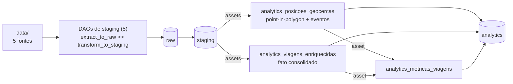

# Pipeline de Dados — Logística

Pipeline ETL em PySpark, orquestrado com Airflow, que processa 5 fontes de dados de logística (frota, motoristas, geocercas, viagens e rastreamento GPS) em um lakehouse em camadas, com enriquecimento geoespacial e métricas agregadas.

O enunciado do desafio está em [desafio.md](desafio.md). O dicionário de dados em [docs/dados.md](docs/dados.md).

## Solução e decisões técnicas

O dado flui por três camadas, todas particionadas por `ingest_date`:

- **raw** — cópia fiel da fonte, sem alterar valores (primitivos lidos como string, para um cast precoce não mascarar valor sujo)
- **staging** — padronização de forma: tipos, formatos, deduplicação por chave e flags de qualidade
- **analytics** — semântica: joins, enriquecimento geoespacial, regras de negócio e agregações

Decisões principais:

**Staging dirigida por config.** Cada tabela declara colunas, tipos, tratamentos e validações em um JSON (`pipelines/<fonte>/staging_<fonte>.json`). Um motor genérico executa a cadeia para qualquer fonte — adicionar fonte nova não exige código, só o registro e os fixtures. O config funciona como contrato: o write aborta se o DataFrame divergir do declarado. A única fonte com código próprio é geocercas, que precisa achatar o GeoJSON antes da cadeia comum.

**Qualidade por quarentena.** Valor inválido é anulado, o motivo vai para `dq_observations` e a linha é marcada em `quality_ok` — mas nunca é descartada, para preservar a chave nos joins. Validações declaradas nos configs cobrem os defeitos do enunciado: coordenadas zeradas ou fora do Brasil, velocidades negativas ou impossíveis, campos obrigatórios, duplicatas. Na analytics, órfãos referenciais (`driver_not_found`, `vehicle_not_found`, ...) são acrescentados à quarentena herdada do staging, sem sobrescrevê-la.

**Geoespacial com Sedona.** O point-in-polygon roda como spatial join dentro do Spark (`ST_Contains`). Cada posição GPS é classificada como `em_geocerca` ou `em_rota`, e eventos de entrada/saída de geocerca são detectados por window functions na sequência temporal de cada viagem. Geometrias malformadas são validadas estruturalmente antes de chegar ao Sedona, para uma geocerca quebrada não derrubar a partição.

**Uma tabela por métrica.** As métricas pedidas têm grãos diferentes (mês × status, rota, motorista, tipo de geocerca), então cada uma vive em sua própria tabela com grão explícito, em vez de uma tabela única com grãos misturados. A velocidade média por viagem está no grão do fato e por isso é coluna da `viagens_enriquecidas`. O registro `METRIC_TABLES` dirige o transform, os testes e o guard de cobertura: métrica nova sem config ou sem golden falha o teste.

**Idempotência por partição.** Cada execução escreve só na sua partição `ingest_date` e pula partições já processadas (checagem barata, antes de subir o Spark). Reprocessar uma data sobrescreve apenas aquela partição. Na gold, o Delta Lake faz isso atomicamente com `replaceWhere`.

**Agendamento por assets.** As DAGs de staging publicam Assets do Airflow; as de analytics agendam pelos assets em vez de cron, então a gold não lê partição que ainda não existe. As DAGs são finas: a lógica PySpark fica em `pipelines/` e `analytics/`.

**Testes golden.** Cada pipeline tem input e output esperados curados nos fixtures (com duplicatas, nulos, órfãos e valores absurdos). O teste roda o tratamento real e compara com o golden por chave primária, reportando linhas faltando, sobrando e diferenças de célula.

## Arquitetura



São 8 DAGs: 4 geradas dinamicamente do registro `STAGING_SOURCES`, 1 dedicada de geocercas e 3 de analytics.

Tabelas da camada analytics:

| Tabela | Grão |
|---|---|
| `posicoes_geocercas` | posição GPS classificada + eventos de entrada/saída |
| `viagens_enriquecidas` | viagem (veículo, motorista, geocercas, duração, atraso, velocidade média, quarentena) |
| `viagens_por_mes_status` | mês × status |
| `tempo_medio_por_rota` | origem × destino |
| `taxa_atraso_mensal` | mês |
| `top_motoristas` | motorista (top 10 por viagens concluídas) |
| `utilizacao_frota_mensal` | mês |
| `tempo_parado_geocercas` | tipo de geocerca |

## Tecnologias

| Tecnologia | Por quê |
|---|---|
| PySpark 3.5.3 | engine de processamento; modo local dentro do worker — o volume não justifica cluster |
| Airflow 3.1.5 (LocalExecutor) | DAGs + agendamento por assets; LocalExecutor dispensa Celery/Redis |
| Apache Sedona 1.9.0 | point-in-polygon distribuído dentro do Spark, sem coletar dados no driver |
| Delta Lake (delta-spark 3.3.2) | versionamento da gold e overwrite atômico por partição (replaceWhere) |
| Docker Compose | stack completa reproduzível; jars do Delta/Sedona baixados no build da imagem |
| pytest + ruff + GitHub Actions | testes unitários e golden, lint e CI |

## Pré-requisitos

- Docker com Compose v2
- ~6 GB de RAM livres e porta 8080 disponível

Não precisa de Python, Java ou Spark na máquina — tudo roda nos containers.

## Como rodar

```bash
docker compose up -d --build
```

Um comando sobe tudo: o `airflow-init` prepara o banco e o `airflow-trigger-dags` despausa e dispara as DAGs — o pipeline roda sozinho após o up.

- UI do Airflow: http://localhost:8080 (`airflow` / `airflow`)
- Saída: `./lakehouse/<camada>/<tabela>/ingest_date=YYYY-MM-DD/`
- Re-executar é seguro: partição já processada é pulada; reprocesso sobrescreve só a própria partição

Testes:

```bash
docker compose --profile debug run --rm airflow-cli bash -c "cd /opt/airflow && python -m pytest tests/ -q"
```

Lint:

```bash
ruff check .
```

Encerrar: `docker compose down` (ou `down -v` para zerar o banco do Airflow).

## Variáveis de ambiente

Definidas no [.env](.env) versionado, com defaults que funcionam sem configurar nada:

| Variável | Default | Uso |
|---|---|---|
| `DATA_DIR` | `/opt/airflow/data` | fontes brutas dentro dos containers |
| `LAKEHOUSE_DIR` | `/opt/airflow/lakehouse` | raiz das camadas raw/staging/analytics |
| `AIRFLOW_UID` | `50000` | permissões dos volumes |
| `AIRFLOW_IMAGE_NAME` | `bigcore-airflow-pyspark:3.1.5` | imagem construída pelo build |
| `_AIRFLOW_WWW_USER_USERNAME` / `_PASSWORD` | `airflow` | credenciais da UI |

Nenhum caminho ou credencial hardcoded: o código lê `DATA_DIR`/`LAKEHOUSE_DIR` do ambiente.

## Estrutura de pastas

```
airflow/dags/          # 8 DAGs finas (lógica importada de pipelines/ e analytics/)
analytics/             # camada gold: código de joins/métricas + contratos JSON + fixtures golden
connections/           # fábrica da SparkSession (get_spark / run_spark)
data/                  # fontes brutas (montadas read-only)
docs/                  # dicionário de dados
lakehouse/             # saída: raw/ staging/ analytics/ (gitignored)
pipelines/             # motor genérico de staging + 1 diretório por fonte (contrato + fixtures)
scripts/parser/        # tratamentos que alteram valores
scripts/data_quality/  # validações que só flaggam (quarentena) + enforce do contrato
scripts/general/       # paths, configs, helpers de I/O Delta
tests/                 # espelha o código: unitários, golden e guard de cobertura
Dockerfile             # airflow 3.1.5 + OpenJDK 17 + jars Delta/Sedona
docker-compose.yml     # postgres + serviços do Airflow + init + trigger-dags
desafio.md             # enunciado original
```
