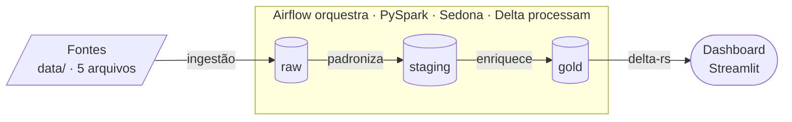

# Pipeline de Dados — Logística

Pipeline ETL em **PySpark**, orquestrado com **Airflow** e persistido em **Delta Lake**, que processa 5 fontes de logística (frota, motoristas, geocercas, viagens e rastreamento GPS) em um lakehouse em camadas, com enriquecimento geoespacial via **Apache Sedona** e métricas agregadas. Sobe com **um comando** no Docker Compose e traz um painel Streamlit para visualizar a saída.

Enunciado do desafio: [desafio.md](desafio.md) · Dicionário de dados: [docs/dados.md](docs/dados.md).

---

## Pré-requisitos

- Docker com Compose v2
- ~6 GB de RAM livres e as portas `8080` (Airflow) e `8501` (painel) disponíveis

Não precisa de Python, Java nem Spark na máquina — tudo roda nos containers.

## Como rodar

```bash
docker compose up -d --build
```

Um comando sobe toda a stack. Na inicialização:

1. `airflow-init` prepara o banco (Postgres) e cria o usuário da UI;
2. `airflow-trigger-dags` despausa todas as DAGs e dispara **apenas as de staging** (as raízes).

As DAGs de analytics **não têm cron**: são agendadas em cascata pelos *assets* das DAGs de staging, então só rodam depois que o staging correspondente existe. Por isso disparamos só as raízes — o pipeline se resolve sozinho após o `up`.

| O quê | Onde |
|---|---|
| UI do Airflow | http://localhost:8080 (`airflow` / `airflow`) |
| Painel de visibilidade (Streamlit) | http://localhost:8501 |
| Saída | `./lakehouse/<camada>/<tabela>/ingest_date=YYYY-MM-DD/` |

**Reprocessar é seguro:** partição já processada é pulada (marcador barato); reprocessar uma data sobrescreve só a própria partição (`replaceWhere`).

Encerrar: `docker compose down` (ou `down -v` para também zerar o banco do Airflow).

## Painel de visibilidade (Streamlit)

Um serviço `dashboard` **sobe junto com a stack** e lê as tabelas gold direto do lakehouse com **delta-rs** (pacote `deltalake`, sem Spark nem JVM): visão executiva com KPIs, gráficos curados por métrica (Altair), mapa das posições GPS, filtro por partição `ingest_date` e download por tabela.

- App: http://localhost:8501

Enquanto o pipeline não materializou a gold, cada tabela aparece como pendente — o app degrada sem quebrar (monta o lakehouse read-only). Também roda localmente, sem Java:

```bash
pip install -r dashboard/requirements.txt
LAKEHOUSE_DIR=./lakehouse streamlit run dashboard/app.py
```

---

## Arquitetura

A arquitetura é um **lakehouse *medallion*** orquestrado por Airflow: as 5 fontes entram, passam por três camadas Delta (`raw → staging → gold`) processadas em PySpark, e a gold é servida por um dashboard. Tudo sobe com **um comando**.



> **Como ler.** As **Fontes** entram no lakehouse, onde o Airflow orquestra o Spark (PySpark + Sedona + Delta) para escrever cada camada — `raw` (cópia fiel) → `staging` (padroniza a forma) → `gold` (enriquece + métricas) — e o **Dashboard** lê a gold via delta-rs. Formas: paralelogramo = arquivos de entrada · cilindro = tabela Delta · cápsula = app.

As três camadas Delta são particionadas por `ingest_date`:

- **raw** — cópia fiel da fonte, sem alterar valores (as fontes de texto são lidas como string, para um cast precoce não mascarar valor sujo)
- **staging** — padronização de **forma**: tipos, formatos, deduplicação por chave e flags de qualidade
- **analytics (gold)** — **semântica**: joins, enriquecimento geoespacial, regras de negócio e agregações

### Por que cada peça

| Peça | Escolha | Por quê |
|---|---|---|
| **Plataforma** | Docker Compose, sobe com 1 comando | ambiente reprodutível; ninguém instala Java/Spark/Python no host |
| **Orquestração** | Airflow 3.1.5 · LocalExecutor + Postgres | agendamento, retries e observabilidade prontos; LocalExecutor dispensa Celery/Redis no volume deste desafio |
| **Agendamento** | staging por cron, analytics por *asset* | a gold nunca lê uma partição que ainda não existe — a cascata se resolve sozinha após o `up` |
| **DAGs finas** | lógica em `pipelines/` e `analytics/` | transform testável fora do Airflow; a DAG só orquestra e checa o marcador |
| **Engine** | PySpark 3.5.3 em modo local | Spark de verdade sem o custo de um cluster para o volume do desafio |
| **Geoespacial** | Apache Sedona (`ST_Intersects`) | point-in-polygon distribuído no Spark, sem coletar no driver; ponto na borda conta como dentro |
| **Storage** | Delta Lake, partição `ingest_date` | overwrite atômico só da partição (`replaceWhere`) + idempotência por marcador `_markers/` |
| **Qualidade** | contrato JSON + flags `dq_observations` | staging entrega só linha consistente; a gold mantém o órfão flaggeado, sem sumir com a viagem |
| **Serving** | Streamlit + delta-rs | visualiza a gold sem subir Spark/JVM; degrada sem quebrar enquanto a gold não existe |
| **CI** | ruff · golden · dag-parse | lint, regressão de dados por chave e smoke de import das 8 DAGs |

São **8 DAGs finas** — a lógica PySpark vive em `pipelines/` (staging) e `analytics/` (gold); as tasks só a importam:

| DAG | Tipo | Agendamento |
|---|---|---|
| `veiculos`, `viagens`, `motoristas`, `posicoes` | staging declarativa (geradas dinamicamente de `STAGING_SOURCES`) | cron `*/10 * * * *` |
| `geocercas` | staging com tratamento próprio (achata o GeoJSON) | cron `*/10 * * * *` |
| `analytics_posicoes_geocercas` | gold — point-in-polygon + eventos de geocerca | assets `staging_posicoes` + `staging_geocercas` |
| `analytics_viagens_enriquecidas` | gold — fato consolidado de viagens | os 5 assets de staging |
| `analytics_metricas_viagens` | gold — 6 métricas agregadas | assets das 2 DAGs de analytics acima |

### Fontes de entrada

| Fonte | Arquivo | Formato |
|---|---|---|
| `veiculos` | `data/veiculos/veiculos.csv` | CSV |
| `viagens` | `data/viagens/viagens.csv` | CSV |
| `motoristas` | `data/motoristas/motoristas.json` | JSON |
| `posicoes` | `data/rastreamento/posicoes.parquet` | Parquet |
| `geocercas` | `data/geocercas/geocercas.geojson` | GeoJSON |

### Tabelas da camada analytics

| Tabela | Grão |
|---|---|
| `viagens_enriquecidas` | 1 viagem: veículo, motorista, geocercas origem/destino, duração, atraso, velocidade média, nº de posições e flags de qualidade |
| `posicoes_geocercas` | posição GPS classificada (`em_geocerca` / `em_rota`) + eventos de entrada/saída de geocerca |
| `viagens_por_mes_status` | mês × status |
| `tempo_medio_por_rota` | geocerca de origem × destino |
| `taxa_atraso_mensal` | mês |
| `top_motoristas` | motorista (top 10 por viagens concluídas) |
| `utilizacao_frota_mensal` | mês |
| `tempo_parado_geocercas` | tipo de geocerca |

---

## Notebooks de análise

Na raiz do projeto, dois notebooks registram a análise que embasou o pipeline (ficam fora do fluxo do Airflow):

- **[analise_dados_raw.ipynb](analise_dados_raw.ipynb)** — análise exploratória dos dados crus (formato, tipos, qualidade e defeitos das fontes), feita para entender os dados antes de modelar o staging.
- **[metricas.ipynb](metricas.ipynb)** — consolidação das métricas: prototipagem dos agregados que depois foram materializados nas tabelas de `analytics/metricas_viagens/`.

---

## Decisões técnicas

**Staging dirigida por config.** Cada tabela declara colunas, tipos, tratamentos e validações em um JSON (`pipelines/<fonte>/staging_<fonte>.json`). Um motor genérico (`pipelines/staging_pipeline.py`) executa a cadeia `treatments → validations → colunas derivadas` para qualquer fonte — adicionar uma fonte declarativa nova não exige código Python, só o registro em `STAGING_SOURCES` e os três fixtures (`input_`, `staging_`, `output_staging_`). O config é um **contrato**: `enforce_table_config` roda antes de todo write e aborta se o DataFrame divergir do declarado. A única fonte com módulo próprio é `geocercas`, que achata o GeoJSON antes da cadeia comum — mas ela **não reimplementa o fluxo**, delega ao mesmo motor genérico passando seu `clean_and_validate`.

**Qualidade: anula, flagga e descarta.** Cada validação declarada anula o valor inválido, registra o motivo em `dq_observations` e marca `quality_ok`. A linha inteira reprovada (`quality_ok = false`) é **descartada** no write do staging — não persiste em nenhuma camada. O transform mede as rejeições antes do descarte (contagem, motivos e % do total) e a task `data_quality` loga o alerta a partir dessas métricas (via XCom): esse alerta é o único rastro das linhas excluídas.

**Na gold nada é excluído.** O fato de viagens usa sempre LEFT JOIN a partir da viagem: órfãos referenciais (`vehicle_not_found`, `driver_not_found`, geocerca inexistente) são flaggados em `dq_observations` / `quality_ok` e **mantidos**, para a contagem de viagens ficar completa — uma viagem não some porque uma dimensão que ela referencia foi descartada no staging. Uma viagem sem posições GPS é rastreamento incompleto, não dado sujo: também é mantida (`num_posicoes` fica nulo), para não subcontar viagens concluídas. Quem quer só linha consistente filtra por `quality_ok` na leitura.

**Geoespacial com Sedona.** O point-in-polygon roda como *spatial join* dentro do Spark, com `ST_Intersects`: um ponto exatamente sobre a borda da geocerca conta como *dentro* (o `ST_Contains` trataria a fronteira como fora, descartando quem está em cima da linha). Cada posição GPS vira `em_geocerca` ou `em_rota`, e eventos de entrada/saída são detectados por *window functions* na sequência temporal de cada viagem. Geometrias malformadas são validadas estruturalmente antes de chegar ao Sedona, para uma geocerca quebrada não derrubar a partição.

**Uma tabela por métrica.** As métricas pedidas têm grãos diferentes (mês × status, rota, motorista, tipo de geocerca), então cada uma vive na própria tabela com grão explícito, em vez de uma tabela única com grãos misturados. O registro `METRIC_TABLES` dirige o transform, o teste golden parametrizado e o guard de cobertura: métrica nova sem config ou sem chave no golden falha o teste. As métricas agregam apenas **viagens válidas** (veículo e motorista resolvidos) — os órfãos ficam na `viagens_enriquecidas`, mas não entram nas agregações (filtro `valid_trips`).

**Idempotência por partição.** Toda camada é Delta particionada por `ingest_date`. Cada execução escreve só na sua partição (na gold, overwrite atômico com `replaceWhere`) e pula partições já processadas por um marcador barato `_markers/<ingest_date>`, checado *antes* de subir o Spark — o Delta não escreve `_SUCCESS`. Reprocessar uma data sobrescreve apenas aquela partição.

**Agendamento por assets.** As DAGs de staging são as raízes (cron) e publicam um Asset do Airflow por fonte ao escrever o staging. As DAGs de analytics não usam cron: agendam pelos assets, então a gold nunca lê uma partição que ainda não existe. Por isso o bootstrap dispara só as raízes e deixa a cascata acontecer.

**DAGs finas.** As DAGs só orquestram e checam marcadores; a lógica PySpark fica em `pipelines/` e `analytics/`, o que mantém tudo testável fora do Airflow. Defaults compartilhados (retries, retry delay, cadência do staging) ficam em `airflow/dags/_defaults.py` — isolado ali de propósito, para a dependência `pendulum` (só do Airflow) nunca alcançar o código de transform puro.

---

## O que eu faria diferente com mais tempo

Dado o escopo e o prazo do desafio, priorizei um pipeline correto, testado e reprodutível. Com mais tempo, evoluiria nestes pontos:

- **Linhagem de dados com OpenMetadata.** Catalogar a linhagem coluna a coluna (fonte → raw → staging → gold → métrica) num catálogo dedicado, com *discovery*, glossário e dono por tabela. Hoje a linhagem é implícita — vive nos *assets* do Airflow e nas colunas de controle (`source_file`, `ingested_at`); o OpenMetadata a tornaria navegável e auditável.

- **Camada de ingestão simulando as origens reais.** Hoje as 5 fontes são arquivos em `data/`. Num cenário de produção, adicionaria uma camada anterior à `raw` que extrai de onde o dado realmente nasceria: **cadastros** (veículos, motoristas, viagens) em **bancos SQL** (via JDBC/CDC), **geocercas em MongoDB** (documentos GeoJSON) e **posições GPS por mensageria — Kafka** (streaming, em vez de um Parquet em batch). Um conector por fonte deixaria o pipeline muito mais próximo do real.

- **Data quality por volumetria (estatística) em `raw` e `staging`.** Além das validações por linha, checar *volumetria*: o volume recebido bate com o esperado? Comparar a contagem por partição contra um baseline / média móvel e alertar em desvios (queda ou pico anômalo, nulos acima do histórico). Isso pega falha de ingestão — arquivo truncado, fonte que mudou de formato — que a validação linha a linha não enxerga.

- **Camada de quarentena.** Essa camada ficaria responsável por armazenar os registros marcados como inconsistentes, para entender melhor a origem de cada inconsistência (problema na coleta? falso positivo? etc.).

- **Dashboard de Data Quality.** Um painel dedicado (separado do executivo) mostrando **qualidade e volumetria por pipeline**: taxa e motivos de rejeição, volume por partição × esperado, tendência no tempo e o conteúdo da quarentena. Fecharia o ciclo de observabilidade dos dados.

- **Modelagem Delta mais performática.** Revisar a estratégia de partição por padrão de acesso: hoje toda camada particiona por `ingest_date`; para algumas tabelas faria mais sentido particionar/organizar por **id** (ou aplicar `OPTIMIZE` + `ZORDER`/clustering e compactação de *small files*) em vez de sempre por data, melhorando joins e leituras.

---

## Tecnologias

| Tecnologia | Por quê |
|---|---|
| PySpark 3.5.3 | engine de processamento; modo local dentro do worker — o volume não justifica cluster |
| Airflow 3.1.5 (LocalExecutor) | DAGs + agendamento por assets; LocalExecutor dispensa Celery/Redis |
| Apache Sedona 1.9.0 | point-in-polygon distribuído dentro do Spark (`ST_Intersects`), sem coletar dados no driver |
| Delta Lake (delta-spark 3.3.2) | versionamento e overwrite atômico por partição (`replaceWhere`) em todas as camadas |
| delta-rs (`deltalake`) | leitura da gold no painel Streamlit sem Spark nem JVM |
| Docker Compose + OpenJDK 17 | stack completa reproduzível; jars do Delta/Sedona baixados no build da imagem |
| pytest + ruff + GitHub Actions | testes unitários e golden, lint e CI |

---

## Testes e CI

Os testes rodam **no container** (o PySpark não roda no ambiente local por incompatibilidade de Java/Python). Os comandos abaixo seguem o mesmo formato — muda só o alvo do `pytest` no fim.

**Todos os módulos:**

```bash
docker compose --profile debug run --rm airflow-cli bash -c "cd /opt/airflow && python -m pytest tests/ -q"
```

**Apenas as pipelines** (teste golden + guard de cobertura):

```bash
docker compose --profile debug run --rm airflow-cli bash -c "cd /opt/airflow && python -m pytest tests/pipelines -q"
```

**Apenas uma pipeline** (troque `geocercas` por `veiculos`, `viagens`, `motoristas` ou `posicoes`):

```bash
docker compose --profile debug run --rm airflow-cli bash -c "cd /opt/airflow && python -m pytest tests/pipelines -k geocercas -q"
```

Lint:

```bash
ruff check .
```

Os testes espelham a estrutura do código: unitários (`parser/`, `data_quality/`, `general/`), integração da gold (`analytics/`), smoke das DAGs (`dags/`) e, em `pipelines/`, o **teste golden** — carrega `input_<fonte>.json`, roda o tratamento real e compara com `output_staging_<fonte>.json` por chave primária, reportando linhas faltando, sobrando e diferenças de célula. O golden é parametrizado por fonte; um **guard de cobertura** falha se uma fonte ativa chegar sem os três fixtures. O golden só é regenerado quando a mudança de comportamento for intencional e o diff revisado:

```bash
docker compose --profile debug run --rm airflow-cli bash -c "cd /opt/airflow && python -m tests.pipelines.regenerate_expected <fonte>"
```

A CI (GitHub Actions) tem três jobs:

| Job | O que faz |
|---|---|
| `lint` | `ruff check .` |
| `dag-parse` | instala o Airflow (mesma versão da imagem) e carrega as 8 DAGs por um `DagBag` — falha se qualquer DAG tiver erro de import; como as suítes de transform não importam Airflow, este job é a rede de segurança das DAGs (só importa, sem subir JVM) |
| `test` | unitários + golden com PySpark/Sedona no runner (jars do Sedona instalados no `pyspark/jars`, como na imagem) |

---

## Variáveis de ambiente

Definidas no [.env](.env) versionado, com defaults que funcionam sem configurar nada:

| Variável | Default | Uso |
|---|---|---|
| `DATA_DIR` | `/opt/airflow/data` | fontes brutas dentro dos containers |
| `LAKEHOUSE_DIR` | `/opt/airflow/lakehouse` | raiz das camadas raw/staging/analytics |
| `AIRFLOW_UID` | `50000` | permissões dos volumes montados |
| `AIRFLOW_IMAGE_NAME` | `bigcore-airflow-pyspark:3.1.5` | imagem construída pelo build |
| `AIRFLOW_PROJ_DIR` | `./airflow` | raiz de `dags/`, `logs/`, `config/`, `plugins/` |
| `_AIRFLOW_WWW_USER_USERNAME` / `_PASSWORD` | `airflow` | credenciais da UI |

Nenhum caminho ou credencial fica hardcoded: o código lê `DATA_DIR` / `LAKEHOUSE_DIR` do ambiente.

---

## Estrutura de pastas

```
airflow/dags/          # 8 DAGs finas + _defaults.py (lógica importada de pipelines/ e analytics/)
analytics/             # camada gold: código de joins/métricas + contratos JSON + fixtures golden
connections/           # fábrica da SparkSession (get_spark / run_spark)
dashboard/             # app Streamlit de visibilidade da gold (lê Delta via delta-rs, sem Spark)
data/                  # 5 fontes brutas (montadas read-only)
docs/                  # dicionário de dados
lakehouse/             # saída: raw/ staging/ analytics/ (gitignored)
pipelines/             # motor genérico de staging + 1 pasta por fonte (contrato + fixtures)
scripts/parser/        # tratamentos que alteram valores
scripts/data_quality/  # validações que só flaggam + enforce do contrato
scripts/general/       # paths, configs, helpers de I/O Delta
tests/                 # espelha o código: unitários, golden, guard de cobertura e smoke de DAG
analise_dados_raw.ipynb  # notebook: análise exploratória das fontes cruas
metricas.ipynb           # notebook: consolidação das métricas
Dockerfile             # Airflow 3.1.5 + OpenJDK 17 + jars Delta/Sedona
docker-compose.yml     # postgres + serviços do Airflow + init + trigger-dags + dashboard
desafio.md             # enunciado original
```
