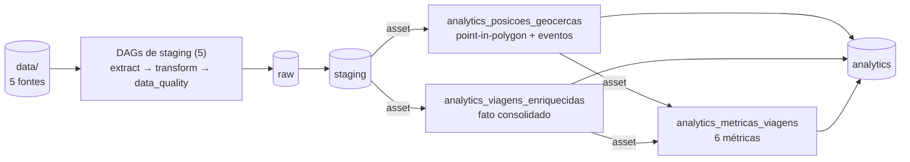

# Pipeline de Dados — Logística

Pipeline ETL em **PySpark**, orquestrado com **Airflow** e persistido em **Delta Lake**, que processa 5 fontes de logística (frota, motoristas, geocercas, viagens e rastreamento GPS) em um lakehouse em camadas, com enriquecimento geoespacial e métricas agregadas. Sobe com **um comando** via Docker Compose.

Enunciado do desafio: [desafio.md](desafio.md) · Dicionário de dados: [docs/dados.md](docs/dados.md).

---

## Pré-requisitos

- Docker com Compose v2
- ~6 GB de RAM livres e a porta `8080` disponível

Não precisa de Python, Java ou Spark na máquina — tudo roda nos containers.

## Como rodar

```bash
docker compose up -d --build
```

Um comando sobe tudo: o `airflow-init` prepara o banco e o `airflow-trigger-dags` despausa todas as DAGs e dispara **apenas as de staging**. As DAGs de analytics são acionadas em cascata pelos seus *assets*, então só rodam depois que o staging correspondente existe — o pipeline se resolve sozinho após o `up`.

- **UI do Airflow:** http://localhost:8080 (`airflow` / `airflow`)
- **Saída:** `./lakehouse/<camada>/<tabela>/ingest_date=YYYY-MM-DD/`
- **Reprocessar é seguro:** partição já processada é pulada; reprocessar uma data sobrescreve só a própria partição

Encerrar: `docker compose down` (ou `down -v` para também zerar o banco do Airflow).

---

## Arquitetura

O dado flui por três camadas, todas Delta e particionadas por `ingest_date`:

- **raw** — cópia fiel da fonte, sem alterar valores (primitivos lidos como string, para um cast precoce não mascarar valor sujo)
- **staging** — padronização de forma: tipos, formatos, deduplicação por chave e flags de qualidade
- **analytics (gold)** — semântica: joins, enriquecimento geoespacial, regras de negócio e agregações



São **8 DAGs finas** (a lógica PySpark vive em `pipelines/` e `analytics/`; as tasks só a importam):

| DAG | Tipo | Agendamento |
|---|---|---|
| `veiculos`, `viagens`, `motoristas`, `posicoes` | staging declarativa (geradas de `STAGING_SOURCES`) | cron `*/10 * * * *` |
| `geocercas` | staging com tratamento próprio (achata o GeoJSON) | cron `*/10 * * * *` |
| `analytics_posicoes_geocercas` | gold — point-in-polygon + eventos | assets de staging |
| `analytics_viagens_enriquecidas` | gold — fato consolidado de viagens | assets de staging |
| `analytics_metricas_viagens` | gold — 6 métricas agregadas | assets de analytics |

### Fontes de entrada

| Fonte | Arquivo | Formato |
|---|---|---|
| `veiculos` | `data/veiculos/veiculos.csv` | CSV |
| `viagens` | `data/viagens/viagens.csv` | CSV |
| `motoristas` | `data/motoristas/motoristas.json` | JSON |
| `posicoes` | `data/rastreamento/posicoes.parquet` | Parquet |
| `geocercas` | `data/geocercas/geocercas.geojson` | GeoJSON |

### Tabelas da camada analytics

| Tabela | Grão |
|---|---|
| `posicoes_geocercas` | posição GPS classificada (`em_geocerca` / `em_rota`) + eventos de entrada/saída |
| `viagens_enriquecidas` | viagem: veículo, motorista, geocercas origem/destino, duração, atraso, velocidade média, quarentena herdada + órfãos |
| `viagens_por_mes_status` | mês × status |
| `tempo_medio_por_rota` | geocerca de origem × destino |
| `taxa_atraso_mensal` | mês |
| `top_motoristas` | motorista (top 10 por viagens concluídas) |
| `utilizacao_frota_mensal` | mês |
| `tempo_parado_geocercas` | tipo de geocerca |

---

## Decisões técnicas

**Staging dirigida por config.** Cada tabela declara colunas, tipos, tratamentos e validações em um JSON (`pipelines/<fonte>/staging_<fonte>.json`). Um motor genérico executa a cadeia para qualquer fonte — adicionar uma fonte declarativa nova não exige código Python, só o registro em `STAGING_SOURCES` e os três fixtures. O config é um **contrato**: `enforce_table_config` roda antes de todo write e aborta se o DataFrame divergir do declarado. A única fonte com código próprio é `geocercas`, que precisa achatar o GeoJSON antes da cadeia comum.

**Qualidade: anula, flagga e descarta.** Cada validação declarada anula o valor inválido, registra o motivo em `dq_observations` e marca `quality_ok`. A linha inteira reprovada (`quality_ok = false`) é **descartada** no write do staging — não persiste em nenhuma camada. O transform mede as rejeições antes do descarte (contagem, motivos e % do total) e a task `data_quality` loga o alerta a partir dessas métricas (via XCom): esse alerta é o único rastro das linhas excluídas. Já na gold **nada é excluído** — órfãos referenciais de join (`driver_not_found`, `vehicle_not_found`, ...) são flaggados em `dq_observations` e mantidos na tabela.

**Geoespacial com Sedona.** O point-in-polygon roda como *spatial join* dentro do Spark, com `ST_Intersects`: um ponto exatamente sobre a borda da geocerca conta como *dentro* (o `ST_Contains` trataria a fronteira como fora, descartando quem está em cima da linha). Cada posição GPS vira `em_geocerca` ou `em_rota`, e eventos de entrada/saída de geocerca são detectados por *window functions* na sequência temporal de cada viagem. Geometrias malformadas são validadas estruturalmente antes de chegar ao Sedona, para uma geocerca quebrada não derrubar a partição.

**Uma tabela por métrica.** As métricas pedidas têm grãos diferentes (mês × status, rota, motorista, tipo de geocerca), então cada uma vive na própria tabela com grão explícito, em vez de uma tabela única com grãos misturados. O registro `METRIC_TABLES` dirige o transform, o teste golden parametrizado e o guard de cobertura: métrica nova sem config ou sem chave no golden falha o teste.

**Idempotência por partição.** Toda camada é Delta particionada por `ingest_date`. Cada execução escreve só na sua partição — na gold, overwrite atômico com `replaceWhere` — e pula partições já processadas por um marcador barato `_markers/<ingest_date>`, checado *antes* de subir o Spark (o Delta não escreve `_SUCCESS`). Reprocessar uma data sobrescreve apenas aquela partição.

**Agendamento por assets.** As DAGs de staging são as raízes (cron) e publicam um Asset do Airflow por fonte ao escrever o staging. As DAGs de analytics não usam cron: agendam pelos assets, então a gold nunca lê uma partição que ainda não existe. Por isso o bootstrap dispara só as raízes e deixa a cascata acontecer.

**DAGs finas.** As DAGs só orquestram e checam marcadores; a lógica PySpark fica em `pipelines/` (staging) e `analytics/` (gold), o que mantém tudo testável fora do Airflow.

---

## Tecnologias

| Tecnologia | Por quê |
|---|---|
| PySpark 3.5.3 | engine de processamento; modo local dentro do worker — o volume não justifica cluster |
| Airflow 3.1.5 (LocalExecutor) | DAGs + agendamento por assets; LocalExecutor dispensa Celery/Redis |
| Apache Sedona 1.9.0 | point-in-polygon distribuído dentro do Spark (`ST_Intersects`), sem coletar dados no driver |
| Delta Lake (delta-spark 3.3.2) | versionamento da gold e overwrite atômico por partição (`replaceWhere`) |
| Docker Compose | stack completa reproduzível; jars do Delta/Sedona baixados no build da imagem |
| pytest + ruff + GitHub Actions | testes unitários e golden, lint e CI |

---

## Testes e CI

Os testes rodam **no container** (o PySpark não roda no ambiente local por incompatibilidade de Java/Python). Os três comandos abaixo seguem o mesmo formato — muda só o alvo do `pytest` no fim:

**Todos os módulos:**

```bash
docker compose --profile debug run --rm airflow-cli bash -c "cd /opt/airflow && python -m pytest tests/ -q"
```

**Apenas as pipelines** (teste golden + guard de cobertura):

```bash
docker compose --profile debug run --rm airflow-cli bash -c "cd /opt/airflow && python -m pytest tests/pipelines -q"
```

**Apenas uma pipeline** (troque `geocercas` por `veiculos`, `viagens`, `motoristas` ou `posicoes`):

```bash
docker compose --profile debug run --rm airflow-cli bash -c "cd /opt/airflow && python -m pytest tests/pipelines -k geocercas -q"
```

Lint:

```bash
ruff check .
```

Os testes espelham a estrutura do código: unitários (`parser/`, `data_quality/`, `general/`), integração da gold (`analytics/`) e, em `pipelines/`, o **teste golden** — carrega `input_<fonte>.json`, roda o tratamento real e compara com `output_staging_<fonte>.json` por chave primária, reportando linhas faltando, sobrando e diferenças de célula. O golden é parametrizado por fonte, então o `-k <fonte>` acima roda só uma (no caso de `geocercas`, o `-k` também pega os testes dedicados do tratamento próprio). Um **guard de cobertura** falha se uma fonte ativa chegar sem os três fixtures.

A CI (GitHub Actions) tem três jobs:

| Job | O que faz |
|---|---|
| `lint` | `ruff check .` |
| `dag-parse` | instala o Airflow e carrega as 8 DAGs por um `DagBag` — falha se qualquer DAG tiver erro de import (as suítes de transform não importam Airflow, então este job é a rede de segurança das DAGs) |
| `test` | unitários + golden com PySpark/Sedona no runner |

---

## Variáveis de ambiente

Definidas no [.env](.env) versionado, com defaults que funcionam sem configurar nada:

| Variável | Default | Uso |
|---|---|---|
| `DATA_DIR` | `/opt/airflow/data` | fontes brutas dentro dos containers |
| `LAKEHOUSE_DIR` | `/opt/airflow/lakehouse` | raiz das camadas raw/staging/analytics |
| `AIRFLOW_UID` | `50000` | permissões dos volumes montados |
| `AIRFLOW_IMAGE_NAME` | `bigcore-airflow-pyspark:3.1.5` | imagem construída pelo build |
| `AIRFLOW_PROJ_DIR` | `./airflow` | raiz de `dags/`, `logs/`, `config/`, `plugins/` |
| `_AIRFLOW_WWW_USER_USERNAME` / `_PASSWORD` | `airflow` | credenciais da UI |

Nenhum caminho ou credencial fica hardcoded: o código lê `DATA_DIR` / `LAKEHOUSE_DIR` do ambiente.

---

## Estrutura de pastas

```
airflow/dags/          # 8 DAGs finas (lógica importada de pipelines/ e analytics/)
analytics/             # camada gold: código de joins/métricas + contratos JSON + fixtures golden
connections/           # fábrica da SparkSession (get_spark / run_spark)
data/                  # 5 fontes brutas (montadas read-only)
docs/                  # dicionário de dados
lakehouse/             # saída: raw/ staging/ analytics/ (gitignored)
pipelines/             # motor genérico de staging + 1 pasta por fonte (contrato + fixtures)
scripts/parser/        # tratamentos que alteram valores
scripts/data_quality/  # validações que só flaggam + enforce do contrato
scripts/general/       # paths, configs, helpers de I/O Delta
tests/                 # espelha o código: unitários, golden, guard de cobertura e smoke de DAG
Dockerfile             # Airflow 3.1.5 + OpenJDK 17 + jars Delta/Sedona
docker-compose.yml     # postgres + serviços do Airflow + init + trigger-dags
desafio.md             # enunciado original
```
